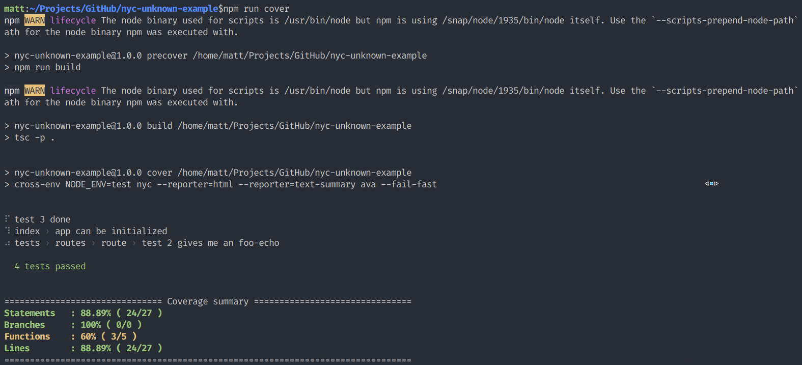
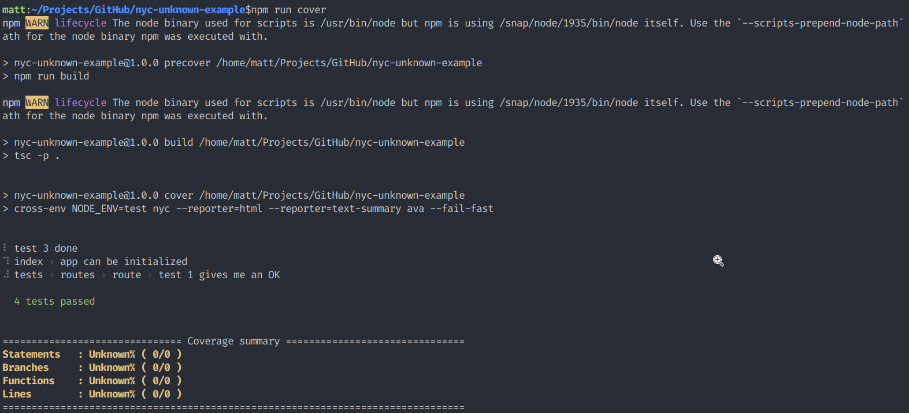

nyc-unknown-example
===================
This repository is an example of a breaking change in coverage functionality between `nyc@12.0.2` and `nyc@>=13.0.0`.

The code here is simple but it outlines the circumstances of a different project which has the following requirements:
- An existing JavaScript project in the process of migration towatds TypeScript, with sources in `./src`.  Compiled files are in `./dist`
- Coverage intended to be collected through *end-to-end integration testing*, by running a `docker-compose.yml` file.  Specifically, to ensure that changes to backend services (one of a number of databases) do not violate established api contracts.
- `nyc` is currently configured to instrument the pre-compiled files in `./dist` and expected to generate coverage reporting using the source maps provided.

## nyc 12.0.2


## nyc 14.0.0



# Configuration
**ava.config.js**
```js
export default {
  files: [
    "dist/**/*.test.js"
  ],
  compileEnhancements: false,
  require: ["source-map-support/register"]
}
```

**.nycrc.json**
```json
{
  "include": ["./src/**/*.js", "./dist/**/*.js"],
  "exclude": ["./src/**/*.spec.js", "./dist/**/*.test.js"],
  "reporter": ["lcov", "text-summary"],
  "sourceMap": true,
  "instrument": true,
  "cache": true,
  "all": false
}
```

**tsconfig.json**
```json
{
  "compilerOptions": {
    "outDir": "./dist",
    "rootDir": "./src",
    "sourceMap": true,
    "inlineSources": true,
    "allowJs": true,
    "experimentalDecorators": true,
    "emitDecoratorMetadata": true,
    "esModuleInterop": true,
    "module": "commonjs",
    "target": "es2018",
    "moduleResolution": "node",
    "incremental": true,
    "tsBuildInfoFile": ".tsBuildInfo"
  },
  "include": ["./src/**/*.js", "./src/**/*.json", "./src/**/*.ts"]
}

```